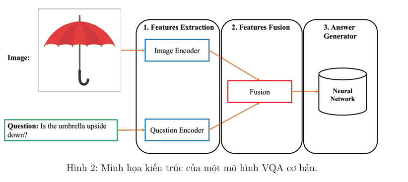

# Visual Question Answering Project (VQA Project) - AIO2024-PM06
- Project ứng dụng các kĩ thuật liên quan đến 2 lĩnh vực là Computer Vision và Natural Language Processing để giải quyết
- Mục tiêu là phân tích một hình ảnh và trả lời câu hỏi về hình ảnh cho trước
- Bước đầu mô hình sử dụng các kĩ thuật xử lý hình ảnh và xử lý câu hỏi đặt ra bằng ngôn ngữ tự nhiên. Tiếp đến, mô hình VQA sẽ tổng hợp thông tin thu được từ phân tích hình ảnh và ngữ cảnh của câu hỏi để tạo ra một câu trả lời phù hợp. 

**Các phiên bản của VQA trong project**
- mạng CNN kết hợp với LSTM
- mạng ViT kết hợp với RoBERTa